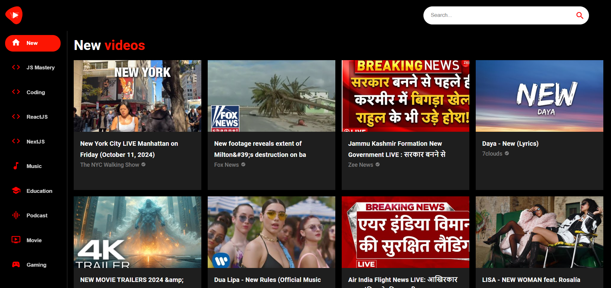
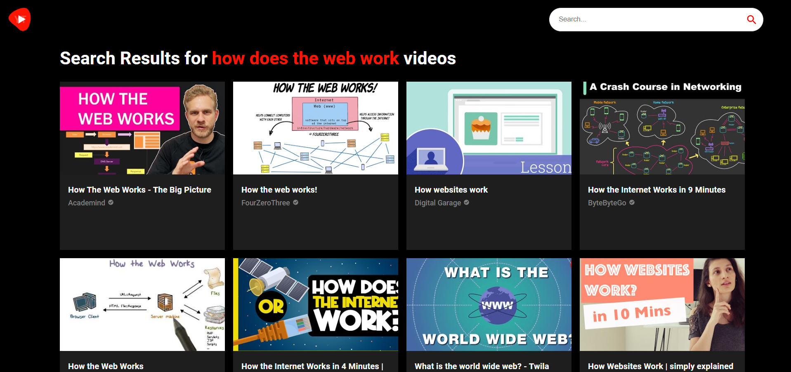
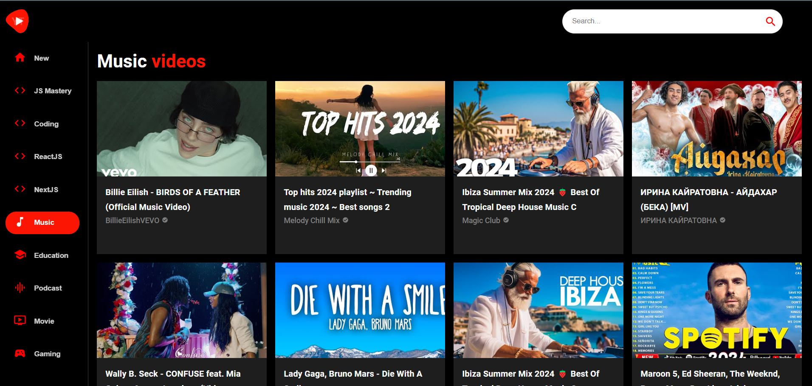
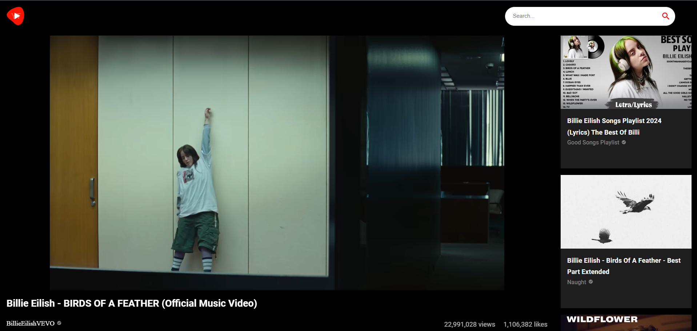

# YouTube Clone

This is a YouTube clone application built with React and Material UI.Users can select categories, view category-specific content, and navigate to video or channel detail pages.It Includes a search functionality that allows users to easily find specific videos.

## Technologies Used

- **React**: Built with React 18 to provide a modern and efficient UI.
- **Material UI**: UI components styled with Material UI and Emotion for a polished look.
- **React Router**: Enables client-side routing for smooth navigation between pages.
- **React Player**: Used to embed video players.
- **Axios**: For making API requests.

## How to Use

1. **Homepage**: The homepage displays a variety of video categories and trending videos.

2. **Search Functionality**: Use the search bar to find specific videos.

3. **Video Player**: Click on any video to watch it using the React Player component.

Screenshots
Home Page

Searched Vidoes

Category Specific Videos Page

Video Detail Page

